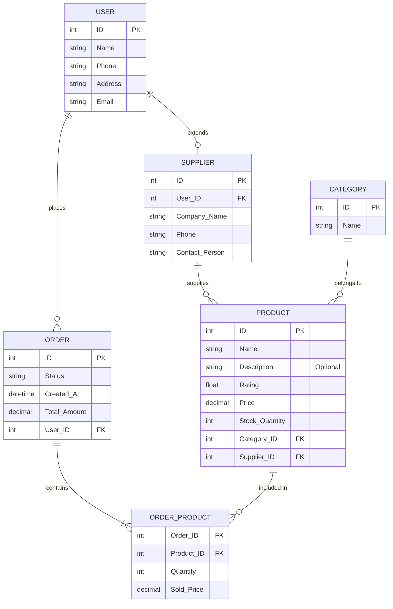

```mermaid
---
config:
  layout: dagre
---
erDiagram

    USER {
        int ID PK
        string Name
        string Phone
        string Address
        string Email
    }

    ORDER {
        int ID PK
        string Status
        datetime Created_At
        decimal Total_Amount
        int User_ID FK
    }

    PRODUCT {
        int ID PK
        string Name
        string Description "Optional"
        float Rating
        decimal Price
        int Stock_Quantity
        int Category_ID FK
        int Supplier_ID FK
    }

    CATEGORY {
        int ID PK
        string Name
    }

    SUPPLIER {
        int ID PK
        int User_ID FK
        string Company_Name
        string Phone
        string Contact_Person
    }


    ORDER_PRODUCT {
        int Order_ID FK
        int Product_ID FK
        int Quantity
        decimal Sold_Price
    }

    USER ||--o{ ORDER : places
    USER ||--o| SUPPLIER : extends
    SUPPLIER ||--o{ PRODUCT : supplies
    CATEGORY ||--o{ PRODUCT : "belongs to"
    ORDER ||--|{ ORDER_PRODUCT : contains
    PRODUCT ||--o{ ORDER_PRODUCT : "included in"
```
