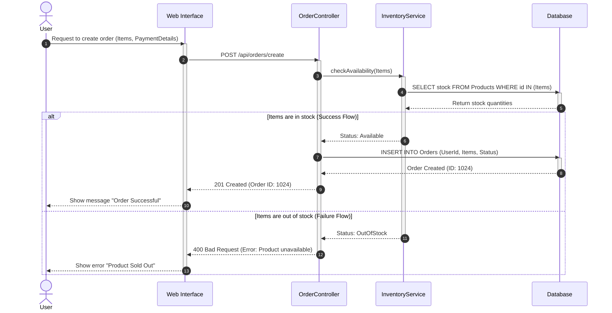

```mermaid
sequenceDiagram
    autonumber
    actor User as User
    participant UI as Web Interface
    participant API as OrderController
    participant Service as InventoryService
    participant DB as Database

    User->>UI: Request to create order (Items, PaymentDetails)
    activate UI
    UI->>API: POST /api/orders/create
    activate API

    API->>Service: checkAvailability(Items)
    activate Service

    Service->>DB: SELECT stock FROM Products WHERE id IN (Items)
    activate DB
    DB-->>Service: Return stock quantities
    deactivate DB

    alt Items are in stock (Success Flow)
        Service-->>API: Status: Available

        API->>DB: INSERT INTO Orders (UserId, Items, Status)
        activate DB
        DB-->>API: Order Created (ID: 1024)
        deactivate DB

        API-->>UI: 201 Created (Order ID: 1024)
        UI-->>User: Show message "Order Successful"

    else Items are out of stock (Failure Flow)
        Service-->>API: Status: OutOfStock
        deactivate Service

        API-->>UI: 400 Bad Request (Error: Product unavailable)
        deactivate API
        UI-->>User: Show error "Product Sold Out"
    end
    deactivate UI
```
