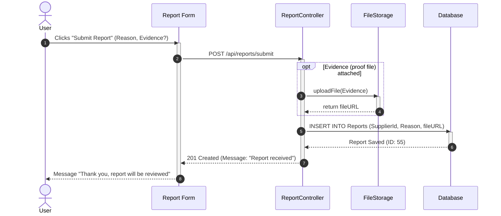

```mermaid
sequenceDiagram
    autonumber
    actor User as User
    participant UI as Report Form
    participant API as ReportController
    participant Storage as FileStorage
    participant DB as Database

    User->>UI: Clicks "Submit Report" (Reason, Evidence?)
    activate UI
    UI->>API: POST /api/reports/submit
    activate API

    opt Evidence (proof file) attached
        API->>Storage: uploadFile(Evidence)
        activate Storage
        Storage-->>API: return fileURL
        deactivate Storage
    end

    API->>DB: INSERT INTO Reports (SupplierId, Reason, fileURL)
    activate DB
    DB-->>API: Report Saved (ID: 55)
    deactivate DB

    API-->>UI: 201 Created (Message: "Report received")
    deactivate API
    UI-->>User: Message "Thank you, report will be reviewed"
    deactivate UI
```